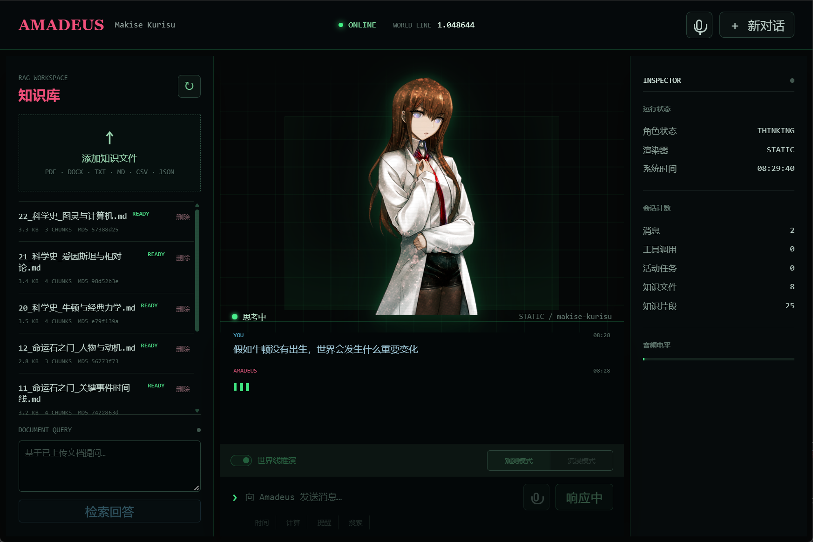

<div align="center">

# AMADEUS

### 世界线观测与推演型 Agent-RAG 智能体

将历史、科学、作品设定和原创人物经历转化为可检索、可解释、可继续探索的世界线档案。

**Agent · RAG · LangGraph · Vue 3 · FastAPI · ChromaDB · GPT-SoVITS**

</div>



## 项目简介

Amadeus 是一个以“数字化人格”为交互概念的角色化 AI 智能体。它不只进行普通聊天，还能上传和检索知识文件、调用外部工具，并围绕用户设置的关键分歧点进行世界线推演。

项目当前的核心定位是：

> 用 RAG 保存“原本发生了什么”，用 Agent 决定“需要检索什么、调用什么”，再通过观测或沉浸模式回答“如果改变一个节点，世界可能如何继续”。

例如，可以向知识库加入牛顿、爱因斯坦、《命运石之门》剧情或原创人物成长经历，再提出：

- 如果牛顿没有走上自然科学研究道路，经典力学会怎样发展？
- 如果某个动漫剧情转折没有发生，人物关系和结局会如何变化？
- 如果原创人物在初二得到家人支持并选择艺考，之后的人生路径可能怎样变化？

## 项目特色

### 世界线双模式

| 模式 | 目标 | 输出方式 |
|---|---|---|
| **观测模式** | 分析“为什么会变化” | 原始世界线、分歧点、约束、因果链和不确定性 |
| **沉浸模式** | 体验“变化后的世界” | 场景、行动、对白、世界线变动率和下一分歧点 |

两个模式使用相同的大模型和知识库。区别不在于模型精度，而在于任务提示词、检索要求和输出策略。

### RAG 不是单纯的格式约束

知识库为推演提供事实基线和私有设定：

```text
上传世界线资料
→ 文档解析与向量化
→ 用户设置分歧点
→ Agent 检索相关证据
→ 区分已知事实、资料缺口和合理假设
→ 生成观测分析或沉浸叙事
```

这使系统能够处理模型原本不知道的原创人物、班级案例和自定义世界观，同时降低混淆史实、原作设定和二创内容的风险。

### Agent 工具调用

Amadeus 使用 LangGraph ReAct Agent，根据用户意图自主决定是否调用工具：

| 工具 | 功能 |
|---|---|
| `get_current_time` | 获取当前时间和日期 |
| `calculate` | 数学计算 |
| `create_reminder` | 创建提醒 |
| `send_email` | 发送邮件 |
| `search_knowledge_base` | 检索知识库 |
| `add_to_knowledge_base` | 写入长期知识 |
| `delete_from_knowledge_base` | 安全删除知识 |
| `search_web` | 搜索最新网页信息 |
| `fetch_text_from_url` | 获取网页正文 |

工具的开始、完成和异常状态会通过 SSE 实时显示在前端，而不是只展示最终答案。

## 已实现功能

- Amadeus 角色化自然对话
- DeepSeek / Qwen 模型切换
- SSE 流式文本与自然换行
- LangGraph ReAct Agent
- 工具调用过程可视化
- PDF、DOCX、TXT、MD、CSV、JSON 文件上传
- MD5 文件去重与知识文件管理
- ChromaDB 向量检索
- 标准 RAG 问答与来源返回
- 世界线观测模式
- 世界线沉浸模式
- SQLite 多轮会话记忆
- 长对话摘要与用户画像提取
- 中断工具调用历史自动修复
- FunASR 中文语音识别
- GPT-SoVITS 日语角色语音
- 三栏角色工作台与响应式布局
- 角色状态和音频电平反馈
- Windows 一键完整停止

## 系统架构

```text
Vue 3 角色工作台
├── Knowledge Workspace
│   ├── 文件上传、列表和删除
│   └── 标准 RAG 问答与来源
├── Character Stage
│   ├── 静态立绘渲染
│   ├── 角色状态与音频反馈
│   └── Live2D 渲染接口预留
├── Conversation Dock
│   ├── SSE 流式对话
│   ├── 工具调用卡片
│   └── 世界线双模式
└── System Inspector
    └── 会话、工具和知识片段状态
             │
             ▼
FastAPI
├── LangGraph ReAct Agent
│   ├── DeepSeek / Qwen
│   ├── Agent Tools
│   └── AsyncSqliteSaver
├── RAG Services
│   ├── KnowledgeBaseService
│   ├── VectorStoreService
│   └── RagService
└── Speech Services
    ├── FunASR STT
    ├── 中文到日文翻译
    └── GPT-SoVITS TTS
```

## 技术栈

| 层级 | 技术 |
|---|---|
| 前端 | Vue 3、Vite |
| 后端 | FastAPI、Pydantic |
| Agent | LangGraph、LangChain |
| LLM | DeepSeek、Qwen（OpenAI 兼容接口） |
| RAG | LangChain LCEL、ChromaDB |
| Embedding | BAAI/bge-small-zh-v1.5 |
| 数据存储 | SQLite、AsyncSqliteSaver |
| 语音识别 | FunASR Paraformer |
| 语音合成 | GPT-SoVITS |
| 通信 | REST、SSE、WebSocket |
| 测试 | Python unittest、Node.js Test Runner |

## 快速开始

### 1. 环境要求

- Windows 10/11
- Python 3.11+
- Node.js 18+
- DeepSeek 或阿里百炼 API Key
- 可选：支持 CUDA 的显卡与 GPT-SoVITS 环境

仅使用文字对话和 RAG 时，不需要安装 GPT-SoVITS。

### 2. 安装后端依赖

```powershell
cd D:/amadeus
python -m pip install -r requirements.txt
```

### 3. 配置环境变量

```powershell
Copy-Item .env.example .env
```

编辑 `.env`，至少配置一个模型提供商：

```ini
# DeepSeek
LLM_PROVIDER=deepseek
DEEPSEEK_API_KEY=sk-your-api-key
DEEPSEEK_MODEL=deepseek-chat

# 或使用 Qwen
# LLM_PROVIDER=qwen
# QWEN_API_KEY=sk-your-qwen-key
# QWEN_MODEL=qwen3.7-plus
```

不要将包含真实 API Key 的 `.env` 提交到 Git。

### 4. 安装前端依赖

```powershell
cd D:/amadeus/frontend
npm install
```

### 5. 启动后端

在项目根目录运行：

```powershell
cd D:/amadeus
python -m uvicorn backend.app.main:app --port 8000
```

日常启动不要添加 `--reload`。Uvicorn 热重载会在 Windows 上创建父子进程，部分 IDE 终端无法通过一次 `Ctrl+C` 完整结束它们。

### 6. 启动前端

打开另一个终端：

```powershell
cd D:/amadeus/frontend
npm run dev
```

访问：<http://localhost:5173>

### 7. 启动语音服务（可选）

语音输出依赖单独安装的 GPT-SoVITS 项目、模型权重和 Python 环境：

```powershell
D:/conda_envs/sovits/python.exe D:/amadeus/start_sovits_api.py
```

详细配置参见 [SETUP.md](SETUP.md)。

### 8. 完全停止

双击项目根目录的：

```text
stop_amadeus.bat
```

脚本会结束占用以下项目端口的完整进程树：

| 端口 | 服务 |
|---|---|
| `5173` | Vue / Vite 前端 |
| `8000` | FastAPI 后端 |
| `9880` | GPT-SoVITS API |

## 世界线知识库

仓库中的 [knowledge_examples](knowledge_examples/) 提供可直接上传的示例：

| 文件 | 用途 |
|---|---|
| `00_使用说明.md` | 知识库使用方式 |
| `01_世界线推演方法.md` | 反事实推演规则 |
| `10_命运石之门_世界线规则.md` | 世界线基础设定 |
| `11_命运石之门_关键事件时间线.md` | 关键剧情节点 |
| `12_命运石之门_人物与动机.md` | 人物约束与动机 |
| `20_科学史_牛顿与经典力学.md` | 科学史案例 |
| `21_科学史_爱因斯坦与相对论.md` | 科学史案例 |
| `22_科学史_图灵与计算机.md` | 科学史案例 |
| `30_原创人物_林默_艺考世界线.md` | 原创人物分支案例 |

自定义文件建议至少包含：

1. 人物或事件背景
2. 原始时间线
3. 关键人物及其动机
4. 资源与现实限制
5. 可改变的分歧点
6. 必须保持不变的事实

## API 概览

启动后访问 Swagger：<http://localhost:8000/docs>

| 接口 | 作用 |
|---|---|
| `GET /api/health` | 健康检查 |
| `POST /api/chat` | 完整聊天回复 |
| `POST /api/chat/stream` | SSE 流式聊天 |
| `POST /api/knowledge/upload` | 上传知识文件 |
| `GET /api/knowledge/files` | 获取知识文件列表 |
| `DELETE /api/knowledge/files/{file_id}` | 删除知识文件 |
| `POST /api/rag/chat` | 标准 RAG 问答 |
| `WS /ws/voice` | 语音合成通道 |
| `WS /ws/voice-chat` | STT + Agent + TTS 语音对话 |

## 项目结构

```text
amadeus/
├── backend/
│   ├── app/
│   │   ├── agent/                 # Agent、提示词和工具
│   │   ├── models/                # API 数据模型
│   │   ├── services/              # 知识库、向量库、RAG、SSE
│   │   ├── speech/                # STT 与 TTS
│   │   └── main.py                # FastAPI 入口
│   └── tests/                     # 后端测试
├── frontend/
│   ├── src/
│   │   ├── components/            # 三栏工作台组件
│   │   ├── composables/           # 聊天、知识库、语音逻辑
│   │   └── domain/                # 角色状态和文本处理
│   └── tests/                     # 前端测试
├── knowledge_examples/            # 世界线知识库示例
├── data/                           # SQLite、ChromaDB 和上传文件
├── docs/                           # 项目报告与升级说明
├── scripts/stop_amadeus.ps1       # 完整停止脚本
├── SETUP.md                        # 环境搭建指南
└── Amadeus项目报告.pdf             # 项目介绍 PDF
```

## 测试

### 后端

```powershell
cd D:/amadeus
python -B -m unittest discover -s backend/tests -v
```

### 前端

```powershell
cd D:/amadeus/frontend
npm test
```

当前测试基线：

- 后端：12 项
- 前端：22 项

## 当前进度

| 功能 | 状态 |
|---|---|
| Agent、RAG、知识库与工具调用 | 已完成 |
| 世界线观测与沉浸模式 | 已完成 |
| DeepSeek / Qwen 切换 | 已完成 |
| 三栏角色工作台 | 已完成 |
| STT / TTS 语音链路 | 已接入，依赖本地模型环境 |
| Live2D 渲染接口 | 已预留 |
| Live2D 模型和口型同步 | 待实现 |
| 一键完整停止 | 已完成 |
| 一键完整启动 | 待实现 |
| 用户系统、多租户和权限 | 待实现 |
| Docker / 云端部署 | 待实现 |

## 路线图

### 稳定演示

- [ ] 一键启动与服务状态检查
- [ ] 模型连接测试和运行日志面板
- [ ] 世界线答案引用片段与报告导出
- [ ] 固定评测问题与 RAG 效果对比
- [ ] Live2D 模型、动作和口型同步

### 持续使用

- [ ] 世界线节点图与分支回溯
- [ ] 多知识库和主题空间
- [ ] 会话、资料与推演项目管理
- [ ] 语音延迟优化和模型降级
- [ ] Windows 安装包或 Docker Compose

### 商业交付

- [ ] 登录、权限、配额和多租户隔离
- [ ] 内容安全、审计、备份与恢复
- [ ] 原创角色资产和商业授权
- [ ] 云端监控、告警和 SLA

## 相关文档

- [完整环境搭建指南](SETUP.md)
- [项目介绍 Markdown](docs/amadeus_project_report.md)
- [项目介绍 PDF](Amadeus项目报告.pdf)
- [RAG 商业化升级说明](docs/rag_upgrade.md)
- [世界线知识库示例](knowledge_examples/)

## 使用与版权说明

本仓库当前版本用于学习、实训和个人作品展示。

“Amadeus”“牧濑红莉栖”“命运石之门”及相关角色设定的著作权归原权利方所有；仓库中的相关角色形象、设定和语音实验不得直接用于未经授权的商业用途。计划商业化时，应替换为原创或已取得授权的角色、立绘、Live2D 模型和声线资源。

世界线推演结果属于基于资料与模型生成的假设性内容，不应被视为历史事实、专业决策结论或对个人未来的确定预测。

---

<div align="center">

**El Psy Kongroo.**

项目作者：陆泽榕

</div>

